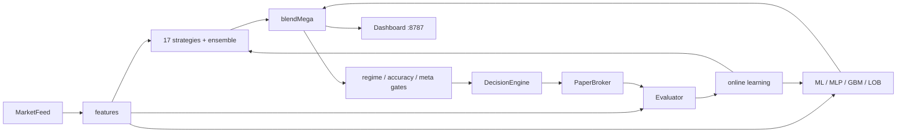

# ZAMBAHOLA ONE AGENT — architecture & roadmap

Single source of truth for what exists today and where development goes next.
Merges the former `PREDICTION_ACCURACY_ROADMAP.md` and `LEARNING_DEVELOPMENT_PATH.md`.

## 1. The core idea (do not lose this)

A self-learning, tick-driven **paper-trading agent** for BTCUSDT. Every tick:

```
feed → features → 17 strategies + ensemble + ML/MLP/GBM/LOB
     → regime / accuracy / meta gates → decision → paper broker
     → horizon evaluation → online learning → back into the models
```

Dashboard on `:8787`, Arabic analyst, dual-agent log review. **Paper mode by
default**; real exchange keys are opt-in and gated. The acceptance bar before
enabling real keys is a **directional hit rate ≥ ~58%**.

Engine id in metrics: `hybrid_v7` (`hybrid_v7_max` in the max-accuracy profile).



## 2. Implemented (through v0.7)

| Capability | Module | Effect |
|-----------|--------|--------|
| 17-strategy ensemble | `prediction-engine/ensemble.ts` | Multi-signal consensus |
| ML + MLP + GBM + LOB proxy | `prediction-engine/*` | `hybrid_v7` blend |
| Adaptive strategy weights | `learning/adaptive-weights.ts` | Up-weights strategies that hit |
| Regime gate + calibration | `learning/` | Phase-aware decisions |
| Meta-label / meta-PnL | `learning/meta-*.ts` | Trust + entry filters |
| Latent S-tier consensus | `prediction-engine/latent-consensus.ts` | Promote directional skew |
| Live feeds + failover | `market-feed/*` | Binance / Bybit / CoinGecko / mock |
| Sentiment + FAPI signals | `sentiment/`, `market-signals/` | Fear/greed, funding, OI |
| Dual-agent log review | `learning/log-auditor.ts` | Self-audit + cleanup |
| Phase-5 overnight automation | `scripts/phase5/*` | Day-live + night training (OMAR-PC) |

## 3. Hardening done in this review (foundation for "powerful" development)

- **Fixed the root-cause "stuck at 0.5"**: unified `INPUT_DIM = 19` (bias + 18
  features); corrected MLP `W1`/`W2` orientation; ML weight migration; GBM and
  MLP shape/dead-weight validation on load.
- **Stability fixes**: fast-feed reconnect timer leak; Binance demo/live close
  order; `forceCloseIfStale` on the broker interface; idempotent engine init;
  unified volatility-aware hit band; hit-rate-guard floor logic; dropped-tick
  counter.
- **Robustness**: atomic JSON I/O everywhere (`writeJsonAtomic`/`readJsonSafe`),
  no silent catches, shared `prediction-engine/math-utils.ts`.
- **Tooling**: Vitest unit tests, ESLint + Prettier, stricter `tsconfig`, CI
  (`.github/workflows/verify.yml`).

## 3b. v0.8 iteration (model depth + calibration + spiral/sign fixes)

Grounded in 2026 microstructure research (order-book features carry ~80% of
short-horizon predictive power) and isotonic calibration best practice:

- **6 depth features appended** (`features/index.ts`): `ret20`, `deepImbalance`
  (top-20 LOB), `bookImbalanceDelta` (order-flow imbalance momentum),
  `vwapDevNorm`, `oiChangeNorm`, `volAccel`. `FEATURE_DIM` 18 → 24 (one central
  constant; ML weights auto-migrate, MLP reshapes, GBM indices stay valid).
- **Broke the abstention death spiral**: models now train on the *realized*
  market direction at the horizon (up=1/down=0, range skipped) instead of the
  abstaining prediction's hit/miss — which had collapsed MLP to a permanent 0.5.
- **Fixed a blend sign bug** (`blendMega`): DOWN votes from ML/MLP/GBM were being
  inverted into UP pushes, crushing directional accuracy in downtrends. Now uses
  signed model deltas directly.
- **Isotonic (PAVA) calibration** (`calibration.ts`): non-parametric monotonic
  recalibration over 780k+ samples, replacing the fixed blend; reliability curve
  + miscalibration (MCB) exposed on the dashboard and `/api/calibration`.
- **Test coverage**: 69 unit tests (strategies, hit-eval, calibration, blend,
  features, models).

Verified live: MLP moved off 0.5 (alive), models produce differentiated probs,
gates pass; the agent correctly abstains in flat/conflicting markets.

## 4. Learning phases (resume anytime)

| Phase | Goal | Command | Artifact |
|-------|------|---------|----------|
| 0 — Live | Paper predictions + dashboard | `agent:start` (or `ZAMBAHOLA_FEED=coingecko`) | `data/runs/latest.jsonl` |
| 1 — Learn | Adaptive strategy weights | `agent:learn` | `strategy-weights.json` |
| 2 — Deep | Regime + calibration | `agent:deep-learn` | `data/learning/*.json` |
| 3 — Mega | Large kline train | `agent:mega-train` | ML/MLP/GBM samples |
| 4 — Ultra | Full pipeline (5000 bars + 30 cycles) | `agent:ultra-learn` | orchestrator metrics |
| 5 — Omni | Hyper-train + walk-forward | `agent:omni-train[:night]` | export bundle |

## 5. Next: developing it "fully and powerfully"

### A. Model quality (highest impact)
1. **Feature depth** — add multi-timeframe returns, deeper LOB history for the
   LOB proxy, order-flow imbalance momentum. Extend `features/index.ts` and bump
   `FEATURE_DIM`/`INPUT_DIM` together (now centralized — one place to change).
2. **Calibration** — make calibration target/curve adaptive
   (`ZAMBAHOLA_CALIBRATION_TARGET` already configurable); add reliability-curve
   monitoring to the dashboard.
3. **Blend weights** — tune `blendMega()` mix per regime instead of fixed
   coefficients.

### B. Test coverage
- Unit-test each strategy's `evaluate()` on synthetic series.
- Property tests for `computeHitBand` / `isPredictionHit`.
- Snapshot test for `blendMega` voter logic.

### C. Safe staged Binance integration
1. Keep paper as default; gate demo behind keys, live behind
   `ZAMBAHOLA_I_ACCEPT_REAL_TRADING=RISK`.
2. Add an order-reconciliation check (exchange position vs paper position).
3. Promote to demo only after directional hit ≥ 58% sustained over N sessions.

### D. Extension points (now clean)
- **New strategy**: add `prediction-engine/strategies/<name>.ts`, register in the
  strategies index (verify expects the count). Reuse `math-utils`.
- **New model**: implement `load/save/predict/train`, use `INPUT_DIM`,
  `writeJsonAtomic`, and add shape/dead-weight validation in
  `learning/model-weight-health.ts`.

## 6. Acceptance metrics

- Directional hit rate ≥ ~58% sustained (guard metric `directional`).
- `lint`, `typecheck`, `test`, `verify`, `agent:test-run` all green.
- No model stuck at 0.5 on mock (covered by unit tests).

## 7. Honest limits

- Mock feed ≠ real BTCUSDT microstructure.
- Short horizons are noisy; hit rate varies.
- No method guarantees profit or 100% accuracy.

Arabic companion: `docs/ar/مسار-التعلم-والتطوير.md`.
